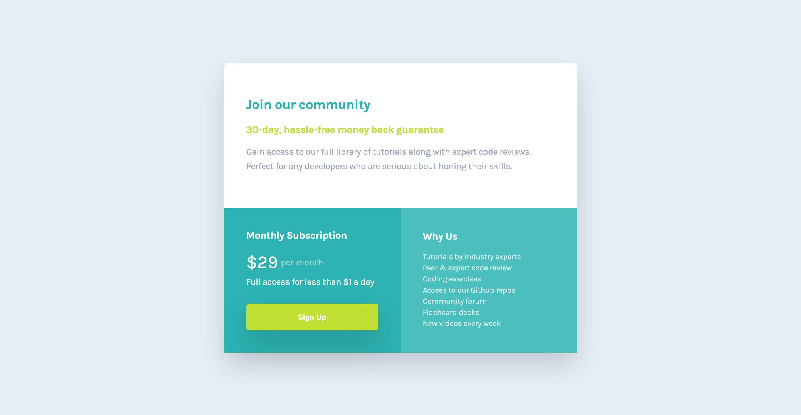

# Frontend Mentor - Single price grid component solution

This is a solution to the [Single price grid component challenge on Frontend Mentor](https://www.frontendmentor.io/challenges/single-price-grid-component-5ce41129d0ff452fec5abbbc). Frontend Mentor challenges help you improve your coding skills by building realistic projects.

## Table of contents

- [Frontend Mentor - Single price grid component solution](#frontend-mentor---single-price-grid-component-solution)
  - [Table of contents](#table-of-contents)
  - [Overview](#overview)
    - [The challenge](#the-challenge)
    - [Screenshot](#screenshot)
    - [Links](#links)
  - [My process](#my-process)
    - [Built with](#built-with)
    - [What I learned](#what-i-learned)
    - [Continued development](#continued-development)
    - [Useful resources](#useful-resources)
  - [Author](#author)
  - [Acknowledgments](#acknowledgments)
    - [Frontend Mentor Slack](#frontend-mentor-slack)

## Overview

### The challenge

Users should be able to:

- View the optimal layout for the component depending on their device's screen size
- See a hover state on desktop for the Sign Up call-to-action

### Screenshot

### Links

- Solution URL: [Frontend mentor](https://www.frontendmentor.io/solutions/react-next-js-with-scss-grid-Jywl0EVri)
- Live Site URL: [Vercel](https://single-price-grid-component-one-black.vercel.app/)

## My process

### Built with

- Semantic HTML5 markup
- SCSS variables and mixin
  - Flexbox
  - CSS Grid
- Mobile-first workflow
- [React](https://reactjs.org/) - JS library
- [Next.js](https://nextjs.org/) - React framework

### What I learned

I furthered my knowledge and utilized CSS Grid. I generally used flex box but wanted to incorporate CSS Grid more when its called for. I wanted to challenge myself by not relaying less on bootstrap and other css frameworks grid systems.

### Continued development

I am still not as comfortable with CSS Grid right now but I going to use it more often replacing bootstrap grid.

### Useful resources

- [Grid by examples](https://gridbyexample.com) - Have several examples and have a free course on CSS Grid.

## Author

- Website - [David Chan Ho](https://www.davidchanho.com)
- Frontend Mentor - [@davidchanho](https://www.frontendmentor.io/profile/davidchanho)

## Acknowledgments

### Frontend Mentor Slack

- Steven Toben - how to utilize css grid properly.
- Silver Graph - media queries and responsive web design.
